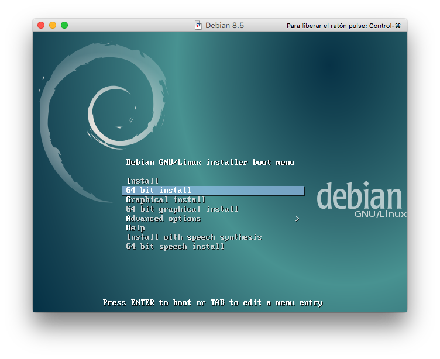
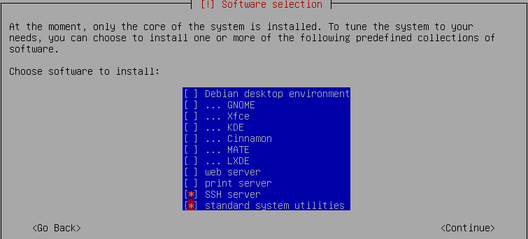

# Preparación del entorno de trabajo

## Máquinas virtuales

Para trabajar en esta asignatura necesitaremos dos máquinas virtuales:
- La primera máquina la llamaremos *"máquina de desarrollo"*. El sistema operativo a usar debe ser una versión moderna de `Ubuntu.
- La segunda máquina la llamaremos *"máquina de producción"*. El sistema operativo a usar deben ser un `Debian 8.5 64bits` ([enlace al .iso](http://cdimage.debian.org/debian-cd/8.5.0/multi-arch/iso-cd/debian-8.5.0-amd64-i386-netinst.iso))

> NOTA: Aunque no es obligatorio, es MUY RECOMENDABLE, que creen el mismo usuario en la *máquina de desarrollo* y en la *máquina de producción*. Facilita el acceso.

En la instalación de la máquina de producción, deberemos seleccionar inicialmente lo siguiente:



Proceder con el resto de la instalación normalmente, hasta llegar a la sección de selección de paquetes. Ahí sólo debemos marcar lo siguiente:



Seguir el resto de pasos y finalizar la instalación.

## Configuración de la interfaz de red

Si vamos a trabajar en el instituto y en casa, tendremos que poder acceder a la máquina de producción desde las dos localizaciones.

### Asignar una IP fija

Dado que tenemos redes diferentes en el instituto y en casa, vamos a configurar la interfaz de red `eth0` de la máquina de producción, para que asuma 2 direcciones de red diferentes, y podamos acceder a ella desde ambas localizaciones:

```console
root@hillvalley:~#
root@hillvalley:~# vi /etc/network/interfaces
```

> Contenido
> ```console
> # This file describes the network interfaces available on your system
> # and how to activate them. For more information, see interfaces(5).
> 
> source /etc/network/interfaces.d/*
> 
> # The loopback network interface
> auto lo
> iface lo inet loopback
> 
> # school interface
> auto eth0:0
> iface eth0:0 inet static
>     address 172.18.<tu_numero>.<lo_que_quieras>    # pon una dirección de tu rango
>     netmask 255.255.0.0
>     broadcast 172.18.255.255
>     post-up route add default gw 172.18.0.1
> 
> # home interface
> auto eth0:1
> iface eth0:1 inet static
>     address 192.168.1.118
>     netmask 255.255.255.0
>     broadcast 192.168.1.255
>     post-up route add default gw 192.168.1.1
> ```

Para que se resuelvan los nombres de dominio, vamos a fijar unos *DNS* que no dependan de los valores que nos retorne el *DHCP*. Para ello, desde la *máquina de producción*, hacemos lo siguiente:

```console
root@hillvalley:~# vi /etc/resolv.conf
```

> Contenido
```console
nameserver 8.8.8.8  # DNS primario de Google
nameserver 8.8.4.4  # DNS secundario de Google
```

Ahora debemos reiniciar nuestra *máquina de producción*, para que todos estos cambios tengan efecto. Ejecutamos como **root**:

```console
root@hillvalley:~# reboot
```

Una vez termine el reinicio, comprobamos que la *máquina de producción* tiene salida hacia internet:

```console
sdelquin@hillvalley:~$ ping -c4 google.com
PING google.com (216.58.211.238) 56(84) bytes of data.
64 bytes from mad01s24-in-f14.1e100.net (216.58.211.238): icmp_seq=1 ttl=56 time=28.5 ms
64 bytes from mad01s24-in-f14.1e100.net (216.58.211.238): icmp_seq=2 ttl=56 time=28.8 ms
64 bytes from mad01s24-in-f14.1e100.net (216.58.211.238): icmp_seq=3 ttl=56 time=28.7 ms
64 bytes from mad01s24-in-f14.1e100.net (216.58.211.238): icmp_seq=4 ttl=56 time=28.6 ms

--- google.com ping statistics ---
4 packets transmitted, 4 received, 0% packet loss, time 3006ms
rtt min/avg/max/mdev = 28.584/28.696/28.879/0.114 ms
sdelquin@hillvalley:~$
```

### Acceso por nombre de máquina

Ahora, **desde la máquina de desarrollo**, para no estar todo el tiempo haciendo uso de la IP para conectarnos a la máquina de producción, podemos añadir un alias (*dns local*). Para ello, haremos lo siguiente como usuario **root**:

```console
~|🍺  sudo vi /etc/hosts
```

> Contenido
```console
...
<ip_de_la_maquina_de_produccion> debian imw produccion
...
```

Ahora, desde la máquina de desarrollo, te podrás referir a la máquina de producción, con los nombres `debian`, `imw` ó `produccion`:

```console
~|🍺  ping debian
PING hillvalley (192.168.1.118): 56 data bytes
64 bytes from 192.168.1.118: icmp_seq=0 ttl=64 time=0.278 ms
64 bytes from 192.168.1.118: icmp_seq=1 ttl=64 time=0.433 ms
^C
--- hillvalley ping statistics ---
2 packets transmitted, 2 packets received, 0.0% packet loss
round-trip min/avg/max/stddev = 0.278/0.356/0.433/0.077 ms
~|🍺
```

Dado que vamos a acceder a nuestra *máquina de producción*, bien desde el instituto o bien desde casa, pondremos un sufijo a los nombres de máquina en el fichero `/etc/hosts` para identificarlos rápidamente. Un ejemplo podría ser lo siguiente:

```console
172.18.10.22    debian.ies imw.ies produccion.ies
192.168.1.118   debian.home imw.home produccion.home
```

## Acceso por SSH (sin password)

La primera vez que intentamos entrar a nuestra máquina de producción (en mi caso se llama `hillvalley`) aparece un mensaje de autenticidad. Escribimos `yes` y pondremos nuestra contraseña.

```console
~|🍺  ssh hillvalley
The authenticity of host 'hillvalley (192.168.1.18)' can't be established.
ECDSA key fingerprint is SHA256:X8yQI7LYM4F2pC7lfnbfOV5wJQtYe/WbafhUARGeoKo.
Are you sure you want to continue connecting (yes/no)? yes
Warning: Permanently added 'hillvalley,192.168.1.18' (ECDSA) to the list of known hosts.
sdelquin@hillvalley's password:

The programs included with the Debian GNU/Linux system are free software;
the exact distribution terms for each program are described in the
individual files in /usr/share/doc/*/copyright.

Debian GNU/Linux comes with ABSOLUTELY NO WARRANTY, to the extent
permitted by applicable law.
sdelquin@hillvalley:~$
```

Al hacer esto, se añadirán los datos del host destino en el fichero `~/.ssh/known_hosts`.

Para no tener que escribir la contraseña de usuario cada vez que nos conectamos a la máquina, podemos hacer uso de la clave pública *RSA*

Lo primero es comprobar si ya disponemos de una clave *RSA* en la máquina de desarrollo. Para eso comprobamos que existan ficheros en el directorio `~.ssh`:

```console
~|🍺  cd .ssh
~/.ssh|🍺  ls
config      id_rsa      id_rsa.pub  known_hosts
~/.ssh|🍺
```

En este caso, sí disponemos de las claves *RSA*:
- `id_rsa`: clave privada. **No compartir nunca con nadie**
- `id_rsa.pub`: clave pública.

En el caso de que no tuviéramos la pareja de claves *RSA*, tenemos que generarlas con el comando `ssh-keygen`.

> NOTA: Ejecutar este comando como usuario **normal**.

```console
~|🍺 ssh-keygen
Generating public/private rsa key pair.
Enter file in which to save the key (/home/sdelquin/.ssh/id_rsa):
Enter passphrase (empty for no passphrase):
Enter same passphrase again:
Your identification has been saved in /home/sdelquin/.ssh/id_rsa.
Your public key has been saved in /home/sdelquin/.ssh/id_rsa.pub.
The key fingerprint is:
b7:5f:51:52:22:46:02:18:19:80:64:85:64:88:12:d9 sdelquin@delorean
The key's randomart image is:
+---[RSA 2048]----+
|oB=+o.o=....+ . .|
|=oE   o    o . o |
|.             . .|
|               o |
|        S .   .  |
|         . .   . |
|          .   .  |
|           . .   |
|            .    |
+-----------------+
~|🍺
```

Ahora debemos copiar (ó añadir) nuestra clave pública `id_rsa.pub` al fichero `authorized_keys` de la máquina de producción (`hillvalley` en mi caso):

```console
~|🍺  scp .ssh/id_rsa.pub hillvalley:~/.ssh/authorized_keys
sdelquin@hillvalley's password:
id_rsa.pub                                                                                 100%  405     0.4KB/s   00:00
~|🍺
```

> NOTA1: El directorio `~/.ssh` debe existir en la máquina de producción. Si no es así, el comando anterior nos dará un error. Para crearlo, habría que entrar por SSH a la máquina de producción, y crear el directorio: `mkdir ~/.ssh`

> NOTA2: Si el fichero `~/.ssh/authorized_keys` no está vacío previamente en la máquina de producción, debemos tener cuidado con el comando anterior, ya que lo podemos sobreescribir. Si existiera habría que añadir el contenido de la clave pública `id_rsa.pub` al final del fichero `authorized_keys`.

Una vez hecho esto, cuando accedamos por *ssh* ya no tendremos que volver a teclear nuestra contraseña:

```console
~|🍺  ssh hillvalley

The programs included with the Debian GNU/Linux system are free software;
the exact distribution terms for each program are described in the
individual files in /usr/share/doc/*/copyright.

Debian GNU/Linux comes with ABSOLUTELY NO WARRANTY, to the extent
permitted by applicable law.
Last login: Sat Aug 27 00:33:20 2016 from 192.168.1.19
sdelquin@hillvalley:~$
```

### Acceso root a ssh

Como norma general, no es recomendable habilitar el acceso por *ssh* como `root`. Es preferible acceder como usuario *"normal"*, y una vez dentro, cambiar a superusuario con el comando `su`.

Sin embargo, sólo para el entorno de clase, y para facilitar al profesor el acceso a las máquinas de producción, se tendrá que habilitar el acceso root por ssh. Para ello, desde la *máquina de producción* y como usuario *root*:

```console
root@hillvalley:~# vi /etc/ssh/sshd_config
```

> Contenido
```ini
...
PermitRootLogin yes
...
```

```console
root@hillvalley:~# /etc/init.d/ssh restart
[ ok ] Restarting ssh (via systemctl): ssh.service.
root@hillvalley:~#
```

Ahora, podemos comprobar que el acceso *root* por *ssh* ya debe de funcionar. Así que ejecutamos lo siguiente desde la *máquina de desarrollo*:

```console
~|🍺  ssh root@hillvalley
root@hillvalley's password:

The programs included with the Debian GNU/Linux system are free software;
the exact distribution terms for each program are described in the
individual files in /usr/share/doc/*/copyright.

Debian GNU/Linux comes with ABSOLUTELY NO WARRANTY, to the extent
permitted by applicable law.
Last login: Fri Aug 26 19:41:22 2016
root@hillvalley:~#
```
