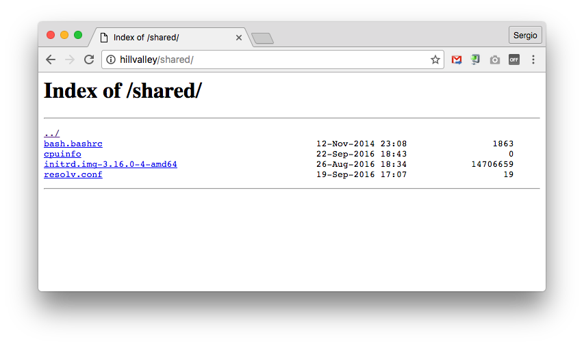

# UT1-A2: Listado de directorios

La actividad consiste en permitir el acceso al contenido de un subdirectorio dentro de la ruta raíz de *Nginx*, enlazando una serie de ficheros desde ahí.

Los requerimientos son los siguientes:

1. Se debe acceder al listado al entrar en **http://aluXXXX/shared/**
2. El listado debe contener los siguientes ficheros:
    - `/boot/initrd.img-4.4.0-9` (imagen del kernel)
    - `/etc/resolv.conf` (listado de DNS)
    - `/etc/bash.bashrc` (configuración global de bash)
    - `/proc/cpuinfo` (características de la máquina)

> NOTA: No se permite copiar los ficheros, sólo se podrán usar enlaces simbólicos utilizando el comando `ln -s`

## Salida deseada

## Fichero a entregar

El fichero a entregar será un informe en formato *PDF*, donde expliques lo que has hecho, justificando tus decisiones.
