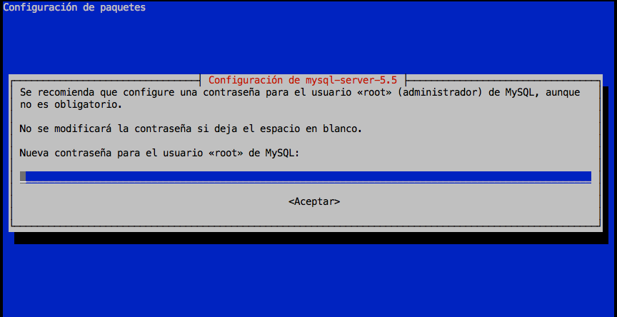
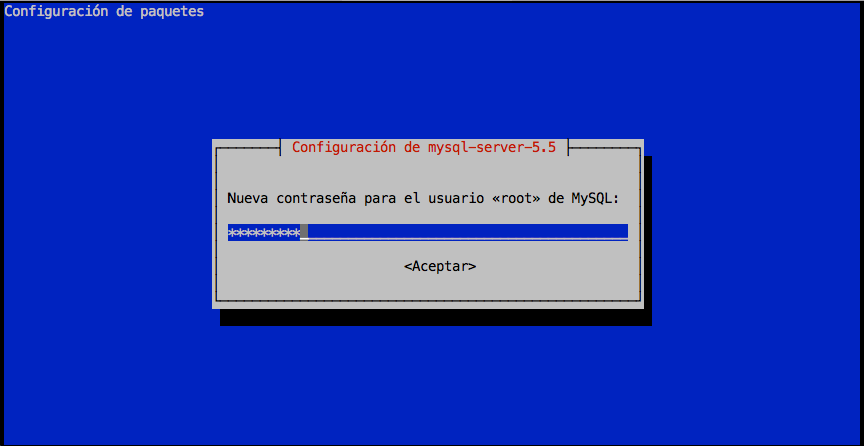

# Base de datos

El sistema gestor de bases de datos que vamos a utilizar es **MySQL**.

## Instalación

Para la instalación vamos a usar el paquete preparado para ello:

```console
root@hillvalley:~# apt-get install mysql-server
Leyendo lista de paquetes... Hecho
Creando árbol de dependencias
Leyendo la información de estado... Hecho
Se instalarán los siguientes paquetes extras:
  libaio1 libdbd-mysql-perl libdbi-perl libhtml-template-perl libmysqlclient18 libterm-readkey-perl
  mysql-client-5.5 mysql-common mysql-server-5.5 mysql-server-core-5.5
Paquetes sugeridos:
  libclone-perl libmldbm-perl libnet-daemon-perl libsql-statement-perl libipc-sharedcache-perl tinyca
Se instalarán los siguientes paquetes NUEVOS:
  libaio1 libdbd-mysql-perl libdbi-perl libhtml-template-perl libmysqlclient18 libterm-readkey-perl
  mysql-client-5.5 mysql-common mysql-server mysql-server-5.5 mysql-server-core-5.5
0 actualizados, 11 nuevos se instalarán, 0 para eliminar y 0 no actualizados.
Se necesita descargar 8.718 kB de archivos.
Se utilizarán 96,3 MB de espacio de disco adicional después de esta operación.
¿Desea continuar? [S/n]
Des:1 http://ftp.es.debian.org/debian/ jessie/main libaio1 amd64 0.3.110-1 [9.312 B]
Des:2 http://ftp.es.debian.org/debian/ jessie/main libdbi-perl amd64 1.631-3+b1 [816 kB]
Des:3 http://security.debian.org/ jessie/updates/main mysql-common all 5.5.50-0+deb8u1 [81,8 kB]
Des:4 http://ftp.es.debian.org/debian/ jessie/main libterm-readkey-perl amd64 2.32-1+b1 [28,0 kB]
Des:5 http://ftp.es.debian.org/debian/ jessie/main libhtml-template-perl all 2.95-1 [66,8 kB]
Des:6 http://security.debian.org/ jessie/updates/main libmysqlclient18 amd64 5.5.50-0+deb8u1 [675 kB]
Des:7 http://security.debian.org/ jessie/updates/main libdbd-mysql-perl amd64 4.028-2+deb8u1 [119 kB]
Des:8 http://security.debian.org/ jessie/updates/main mysql-client-5.5 amd64 5.5.50-0+deb8u1 [1.659 kB]
Des:9 http://security.debian.org/ jessie/updates/main mysql-server-core-5.5 amd64 5.5.50-0+deb8u1 [3.414 kB]
Des:10 http://security.debian.org/ jessie/updates/main mysql-server-5.5 amd64 5.5.50-0+deb8u1 [1.769 kB]
Des:11 http://security.debian.org/ jessie/updates/main mysql-server all 5.5.50-0+deb8u1 [80,0 kB]
Descargados 8.718 kB en 1s (6.773 kB/s)
Preconfigurando paquetes ...
```

En este punto, el instalador nos pedirá poner la clave del usuario `root` que gestionará **MySQL**:



Y a continuación repetir la clave:



La instalación continua hasta terminar de configurar todos los paquetes:

```console
Seleccionando el paquete libaio1:amd64 previamente no seleccionado.
(Leyendo la base de datos ... 31339 ficheros o directorios instalados actualmente.)
Preparando para desempaquetar .../libaio1_0.3.110-1_amd64.deb ...
Desempaquetando libaio1:amd64 (0.3.110-1) ...
Seleccionando el paquete mysql-common previamente no seleccionado.
Preparando para desempaquetar .../mysql-common_5.5.50-0+deb8u1_all.deb ...
Desempaquetando mysql-common (5.5.50-0+deb8u1) ...
Seleccionando el paquete libmysqlclient18:amd64 previamente no seleccionado.
Preparando para desempaquetar .../libmysqlclient18_5.5.50-0+deb8u1_amd64.deb ...
Desempaquetando libmysqlclient18:amd64 (5.5.50-0+deb8u1) ...
Seleccionando el paquete libdbi-perl previamente no seleccionado.
Preparando para desempaquetar .../libdbi-perl_1.631-3+b1_amd64.deb ...
Desempaquetando libdbi-perl (1.631-3+b1) ...
Seleccionando el paquete libdbd-mysql-perl previamente no seleccionado.
Preparando para desempaquetar .../libdbd-mysql-perl_4.028-2+deb8u1_amd64.deb ...
Desempaquetando libdbd-mysql-perl (4.028-2+deb8u1) ...
Seleccionando el paquete libterm-readkey-perl previamente no seleccionado.
Preparando para desempaquetar .../libterm-readkey-perl_2.32-1+b1_amd64.deb ...
Desempaquetando libterm-readkey-perl (2.32-1+b1) ...
Seleccionando el paquete mysql-client-5.5 previamente no seleccionado.
Preparando para desempaquetar .../mysql-client-5.5_5.5.50-0+deb8u1_amd64.deb ...
Desempaquetando mysql-client-5.5 (5.5.50-0+deb8u1) ...
Seleccionando el paquete mysql-server-core-5.5 previamente no seleccionado.
Preparando para desempaquetar .../mysql-server-core-5.5_5.5.50-0+deb8u1_amd64.deb ...
Desempaquetando mysql-server-core-5.5 (5.5.50-0+deb8u1) ...
Procesando disparadores para man-db (2.7.0.2-5) ...
Configurando mysql-common (5.5.50-0+deb8u1) ...
Seleccionando el paquete mysql-server-5.5 previamente no seleccionado.
(Leyendo la base de datos ... 31706 ficheros o directorios instalados actualmente.)
Preparando para desempaquetar .../mysql-server-5.5_5.5.50-0+deb8u1_amd64.deb ...
Desempaquetando mysql-server-5.5 (5.5.50-0+deb8u1) ...
Seleccionando el paquete libhtml-template-perl previamente no seleccionado.
Preparando para desempaquetar .../libhtml-template-perl_2.95-1_all.deb ...
Desempaquetando libhtml-template-perl (2.95-1) ...
Seleccionando el paquete mysql-server previamente no seleccionado.
Preparando para desempaquetar .../mysql-server_5.5.50-0+deb8u1_all.deb ...
Desempaquetando mysql-server (5.5.50-0+deb8u1) ...
Procesando disparadores para systemd (215-17+deb8u4) ...
Procesando disparadores para man-db (2.7.0.2-5) ...
Configurando libaio1:amd64 (0.3.110-1) ...
Configurando libmysqlclient18:amd64 (5.5.50-0+deb8u1) ...
Configurando libdbi-perl (1.631-3+b1) ...
Configurando libdbd-mysql-perl (4.028-2+deb8u1) ...
Configurando libterm-readkey-perl (2.32-1+b1) ...
Configurando mysql-client-5.5 (5.5.50-0+deb8u1) ...
Configurando mysql-server-core-5.5 (5.5.50-0+deb8u1) ...
Configurando mysql-server-5.5 (5.5.50-0+deb8u1) ...
160827  1:39:59 [Warning] Using unique option prefix key_buffer instead of key_buffer_size is deprecated and will be removed in a future release. Please use the full name instead.
160827  1:39:59 [Note] /usr/sbin/mysqld (mysqld 5.5.50-0+deb8u1) starting as process 2813 ...
Configurando libhtml-template-perl (2.95-1) ...
Configurando mysql-server (5.5.50-0+deb8u1) ...
Procesando disparadores para libc-bin (2.19-18+deb8u4) ...
Procesando disparadores para systemd (215-17+deb8u4) ...
root@hillvalley:~#
```

Una vez finalizada la instalación, podemos comprobar que el servicio está corriendo:

```console
root@hillvalley:~# /etc/init.d/mysql status
● mysql.service - LSB: Start and stop the mysql database server daemon
   Loaded: loaded (/etc/init.d/mysql)
   Active: active (running) since sáb 2016-08-27 01:40:10 WEST; 5min ago
   CGroup: /system.slice/mysql.service
           ├─2970 /bin/sh /usr/bin/mysqld_safe
           └─3317 /usr/sbin/mysqld --basedir=/usr --datadir=/var/lib/mysql --plugin-dir=/usr/lib/mysql/p...

ago 27 01:40:10 hillvalley /etc/mysql/debian-start[3378]: mysql.help_keyword                          ...OK
ago 27 01:40:10 hillvalley /etc/mysql/debian-start[3378]: mysql.help_relation                         ...OK
ago 27 01:40:10 hillvalley /etc/mysql/debian-start[3378]: mysql.help_topic                            ...OK
ago 27 01:40:10 hillvalley /etc/mysql/debian-start[3378]: mysql.host                                  ...OK
ago 27 01:40:10 hillvalley /etc/mysql/debian-start[3378]: mysql.ndb_binlog_index                      ...OK
ago 27 01:40:10 hillvalley /etc/mysql/debian-start[3378]: mysql.plugin                                ...OK
ago 27 01:40:10 hillvalley /etc/mysql/debian-start[3378]: mysql.proc                                  ...OK
ago 27 01:40:10 hillvalley /etc/mysql/debian-start[3378]: mysql.procs_priv                            ...OK
ago 27 01:40:10 hillvalley /etc/mysql/debian-start[3428]: Checking for insecure root accounts.
ago 27 01:40:10 hillvalley /etc/mysql/debian-start[3433]: Triggering myisam-recover for all MyISAM tables
Hint: Some lines were ellipsized, use -l to show in full.
root@hillvalley:~#
```

## Acceso al gestor de bases de datos

El comando que nos permite gestionar las bases de datos **MySQL** es, aunque parezca increíble `mysql` 😉 . Nótese que el parámetro `-u` indica el usuario y `-p` indica que se va a acceder a través de contraseña.

```console
sdelquin@hillvalley:~$ mysql -u root -p
Enter password:
Welcome to the MySQL monitor.  Commands end with ; or \g.
Your MySQL connection id is 44
Server version: 5.5.50-0+deb8u1 (Debian)

Copyright (c) 2000, 2016, Oracle and/or its affiliates. All rights reserved.

Oracle is a registered trademark of Oracle Corporation and/or its
affiliates. Other names may be trademarks of their respective
owners.

Type 'help;' or '\h' for help. Type '\c' to clear the current input statement.

mysql>
```

## Ajuste de codificaciones

*MySQL* maneja una gran cantidad de variables globales, que configuran su comportamiento. Se pueden ver utilizando el comando `show variables;` dentro de una sesión en el intérprete.

Es importante ajustar las codificaciones que utiliza el sistema gestor. Primero vemos el valor que tienen utilizando el siguiente comando:

```sql
mysql> SHOW VARIABLES WHERE Variable_name LIKE 'character\_set\_%' OR Variable_name LIKE 'collation%';
+--------------------------+-------------------+
| Variable_name            | Value             |
+--------------------------+-------------------+
| character_set_client     | utf8              |
| character_set_connection | utf8              |
| character_set_database   | latin1            |
| character_set_filesystem | binary            |
| character_set_results    | utf8              |
| character_set_server     | latin1            |
| character_set_system     | utf8              |
| collation_connection     | utf8_general_ci   |
| collation_database       | latin1_swedish_ci |
| collation_server         | latin1_swedish_ci |
+--------------------------+-------------------+
10 rows in set (0.00 sec)
mysql>
```

Lo que queremos, es que todas las variables de codificación estén fijadas a `utf8mb4`.

El fichero de configuración de **MySQL** se encuentra en: `/etc/mysql/my.cnf`, pero se pueden incluir ficheros de configuración en la ruta: `/etc/mysql/conf.d/`

```console
root@hillvalley:~# vi /etc/mysql/conf.d/utf8mb4.cnf
```

>Contenido
```ini
[client]
default-character-set = utf8mb4
[mysql]
default-character-set = utf8mb4
[mysqld]
character-set-client-handshake = FALSE
character-set-server = utf8mb4
collation-server = utf8mb4_unicode_ci
```

Reiniciamos el servidor:

```console
root@hillvalley:~# /etc/init.d/mysql restart
[ ok ] Restarting mysql (via systemctl): mysql.service.
root@hillvalley:~#
```

Accedemos de nuevo al intérprete SQL de **MySQL** para comprobar de nuevo las variables:

```sql
mysql> SHOW VARIABLES WHERE Variable_name LIKE 'character\_set\_%' OR Variable_name LIKE 'collation%';
+--------------------------+--------------------+
| Variable_name            | Value              |
+--------------------------+--------------------+
| character_set_client     | utf8mb4            |
| character_set_connection | utf8mb4            |
| character_set_database   | utf8mb4            |
| character_set_filesystem | binary             |
| character_set_results    | utf8mb4            |
| character_set_server     | utf8mb4            |
| character_set_system     | utf8               |
| collation_connection     | utf8mb4_unicode_ci |
| collation_database       | utf8mb4_unicode_ci |
| collation_server         | utf8mb4_unicode_ci |
+--------------------------+--------------------+
10 rows in set (0.00 sec)

mysql> Bye
```

* [x] Ahora sí tenemos todas las variables ajustadas a `utf8mb4`.

## Instalación segura

La instalación por defecto de *MySQL* deja una base de datos de test y algunas cuentas extrañas de usuario, que pueden ser origen de problemas de seguridad. Vamos a intentar solucionar estos problemas usando el comando `mysql_secure_installation`:

```console
root@hillvalley:~# mysql_secure_installation


NOTE: RUNNING ALL PARTS OF THIS SCRIPT IS RECOMMENDED FOR ALL MySQL
      SERVERS IN PRODUCTION USE!  PLEASE READ EACH STEP CAREFULLY!


In order to log into MySQL to secure it, we'll need the current
password for the root user.  If you've just installed MySQL, and
you haven't set the root password yet, the password will be blank,
so you should just press enter here.

Enter current password for root (enter for none):
OK, successfully used password, moving on...

Setting the root password ensures that nobody can log into the MySQL
root user without the proper authorisation.

You already have a root password set, so you can safely answer 'n'.

Change the root password? [Y/n] n
 ... skipping.

By default, a MySQL installation has an anonymous user, allowing anyone
to log into MySQL without having to have a user account created for
them.  This is intended only for testing, and to make the installation
go a bit smoother.  You should remove them before moving into a
production environment.

Remove anonymous users? [Y/n] Y
 ... Success!

Normally, root should only be allowed to connect from 'localhost'.  This
ensures that someone cannot guess at the root password from the network.

Disallow root login remotely? [Y/n] Y
 ... Success!

By default, MySQL comes with a database named 'test' that anyone can
access.  This is also intended only for testing, and should be removed
before moving into a production environment.

Remove test database and access to it? [Y/n] Y
 - Dropping test database...
ERROR 1008 (HY000) at line 1: Can't drop database 'test'; database doesn't exist
 ... Failed!  Not critical, keep moving...
 - Removing privileges on test database...
 ... Success!

Reloading the privilege tables will ensure that all changes made so far
will take effect immediately.

Reload privilege tables now? [Y/n] Y
 ... Success!

Cleaning up...


All done!  If you've completed all of the above steps, your MySQL
installation should now be secure.

Thanks for using MySQL!


root@hillvalley:~#
```

* [x] Instalación segura completada.

### Política de contraseñas

Con la "segurización" de las contraseñas, se obliga a cumplir con los siguientes criterios:

- La longitud de la contraseña debe ser de 8 o más caracteres.
- Deben incluir, al menos, uno de los siguientes caracteres:
  + Letras en mayúsculas.
  + Letras en minúsculas.
  + Dígitos.
  + Caracteres especiales ("!", "@", "$", etc.).


