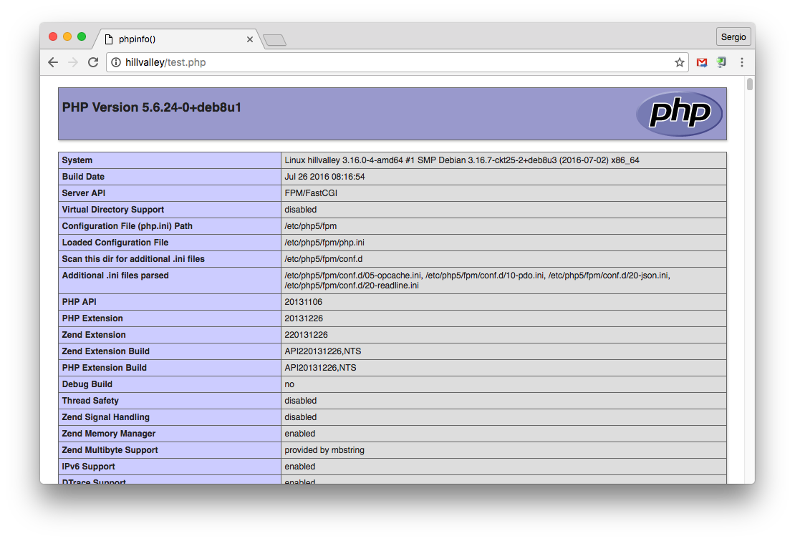

# Configuración de PHP

**PHP** es un lenguaje de programación, ampliamente utilizado en la generación de contenido web.

## Instalación

Aunque ya hemos instalado [el servidor web Nginx](../webserver), necesitamos un módulo adicional que procese el lenguaje PHP.

Existen varios módulos de tratamiento de PHP, pero el más usado es `php-fpm`. Para su instalación usaremos el paquete `php5-fpm` disponible en los repositorios de *apt*:

```console
root@hillvalley:~# apt-get install php5-fpm
Leyendo lista de paquetes... Hecho
Creando árbol de dependencias
Leyendo la información de estado... Hecho
Se instalarán los siguientes paquetes extras:
  libapparmor1 libonig2 libqdbm14 php5-cli php5-common php5-json php5-readline
Paquetes sugeridos:
  php-pear php5-user-cache
Se instalarán los siguientes paquetes NUEVOS:
  libapparmor1 libonig2 libqdbm14 php5-cli php5-common php5-fpm php5-json php5-readline
0 actualizados, 8 nuevos se instalarán, 0 para eliminar y 0 no actualizados.
Se necesita descargar 5.441 kB de archivos.
Se utilizarán 20,4 MB de espacio de disco adicional después de esta operación.
¿Desea continuar? [S/n]
Des:1 http://ftp.es.debian.org/debian/ jessie/main libonig2 amd64 5.9.5-3.2 [118 kB]
Des:2 http://ftp.es.debian.org/debian/ jessie/main libqdbm14 amd64 1.8.78-5+b1 [118 kB]
Des:3 http://ftp.es.debian.org/debian/ jessie/main php5-json amd64 1.3.6-1 [18,6 kB]
Des:4 http://ftp.es.debian.org/debian/ jessie/main libapparmor1 amd64 2.9.0-3 [60,3 kB]
Des:5 http://security.debian.org/ jessie/updates/main php5-common amd64 5.6.24+dfsg-0+deb8u1 [725 kB]
Des:6 http://security.debian.org/ jessie/updates/main php5-cli amd64 5.6.24+dfsg-0+deb8u1 [2.187 kB]
Des:7 http://security.debian.org/ jessie/updates/main php5-fpm amd64 5.6.24+dfsg-0+deb8u1 [2.201 kB]
Des:8 http://security.debian.org/ jessie/updates/main php5-readline amd64 5.6.24+dfsg-0+deb8u1 [12,7 kB]
Descargados 5.441 kB en 6s (901 kB/s)
Seleccionando el paquete libonig2:amd64 previamente no seleccionado.
(Leyendo la base de datos ... 33832 ficheros o directorios instalados actualmente.)
Preparando para desempaquetar .../libonig2_5.9.5-3.2_amd64.deb ...
Desempaquetando libonig2:amd64 (5.9.5-3.2) ...
Seleccionando el paquete libqdbm14 previamente no seleccionado.
Preparando para desempaquetar .../libqdbm14_1.8.78-5+b1_amd64.deb ...
Desempaquetando libqdbm14 (1.8.78-5+b1) ...
Seleccionando el paquete php5-common previamente no seleccionado.
Preparando para desempaquetar .../php5-common_5.6.24+dfsg-0+deb8u1_amd64.deb ...
Desempaquetando php5-common (5.6.24+dfsg-0+deb8u1) ...
Seleccionando el paquete php5-json previamente no seleccionado.
Preparando para desempaquetar .../php5-json_1.3.6-1_amd64.deb ...
Desempaquetando php5-json (1.3.6-1) ...
Seleccionando el paquete php5-cli previamente no seleccionado.
Preparando para desempaquetar .../php5-cli_5.6.24+dfsg-0+deb8u1_amd64.deb ...
Desempaquetando php5-cli (5.6.24+dfsg-0+deb8u1) ...
Seleccionando el paquete libapparmor1:amd64 previamente no seleccionado.
Preparando para desempaquetar .../libapparmor1_2.9.0-3_amd64.deb ...
Desempaquetando libapparmor1:amd64 (2.9.0-3) ...
Seleccionando el paquete php5-fpm previamente no seleccionado.
Preparando para desempaquetar .../php5-fpm_5.6.24+dfsg-0+deb8u1_amd64.deb ...
Desempaquetando php5-fpm (5.6.24+dfsg-0+deb8u1) ...
Seleccionando el paquete php5-readline previamente no seleccionado.
Preparando para desempaquetar .../php5-readline_5.6.24+dfsg-0+deb8u1_amd64.deb ...
Desempaquetando php5-readline (5.6.24+dfsg-0+deb8u1) ...
Procesando disparadores para man-db (2.7.0.2-5) ...
Procesando disparadores para systemd (215-17+deb8u4) ...
Configurando libonig2:amd64 (5.9.5-3.2) ...
Configurando libqdbm14 (1.8.78-5+b1) ...
Configurando php5-common (5.6.24+dfsg-0+deb8u1) ...

Creating config file /etc/php5/mods-available/pdo.ini with new version
php5_invoke: Enable module pdo for cli SAPI
php5_invoke: Enable module pdo for fpm SAPI

Creating config file /etc/php5/mods-available/opcache.ini with new version
php5_invoke: Enable module opcache for cli SAPI
php5_invoke: Enable module opcache for fpm SAPI
Configurando php5-json (1.3.6-1) ...
php5_invoke: Enable module json for cli SAPI
php5_invoke: Enable module json for fpm SAPI
Configurando php5-cli (5.6.24+dfsg-0+deb8u1) ...
update-alternatives: utilizando /usr/bin/php5 para proveer /usr/bin/php (php) en modo automático
update-alternatives: utilizando /usr/bin/phar5 para proveer /usr/bin/phar (phar) en modo automático

Creating config file /etc/php5/cli/php.ini with new version
Configurando libapparmor1:amd64 (2.9.0-3) ...
Configurando php5-fpm (5.6.24+dfsg-0+deb8u1) ...

Creating config file /etc/php5/fpm/php.ini with new version
Configurando php5-readline (5.6.24+dfsg-0+deb8u1) ...

Creating config file /etc/php5/mods-available/readline.ini with new version
php5_invoke: Enable module readline for cli SAPI
php5_invoke: Enable module readline for fpm SAPI
Procesando disparadores para libc-bin (2.19-18+deb8u4) ...
Procesando disparadores para systemd (215-17+deb8u4) ...
Procesando disparadores para php5-fpm (5.6.24+dfsg-0+deb8u1) ...
root@hillvalley:~#
```

## Configuración

A continuación tenemos que indicarle al servidor web, en este caso **Nginx**, que debe utilizar el módulo `php5-fpm` cuando vaya a manejar ficheros `.php`.

El fichero de configuración de **Nginx** está en `/etc/nginx/nginx.conf`. A su vez, existen una serie de ficheros adicionales de configuración colgando de `/etc/nginx/sites-available`. En concreto, debemos editar el fichero de configuración general `/etc/nginx/sites-available/default`:

```console
root@hillvalley:~# vi /etc/nginx/sites-available/default
```

Buscamos la sección de **PHP**:

```nginx
    # Add index.php to the list if you are using PHP
    index index.html index.htm index.nginx-debian.html;
    ...
    #location ~ \.php$ {
    # include snippets/fastcgi-php.conf;
    #
    # # With php5-cgi alone:
    # fastcgi_pass 127.0.0.1:9000;
    # # With php5-fpm:
    # fastcgi_pass unix:/var/run/php5-fpm.sock;
    #}
```

Añadimos `index.php` como posible fichero de inicio y descomentamos las líneas que nos interesan, con lo que quedaría así:

```nginx
    # Add index.php to the list if you are using PHP
    index index.html index.htm index.nginx-debian.html index.php;
    ...
    location ~ \.php$ {
      try_files $uri =404;
      include snippets/fastcgi-php.conf;
    #
    # # With php5-cgi alone:
    # fastcgi_pass 127.0.0.1:9000;
    # # With php5-fpm:
      fastcgi_pass unix:/var/run/php5-fpm.sock;
    }
```

Ya sólo nos falta recargar el servidor web:

```console
root@hillvalley:~# /etc/init.d/nginx reload
[ ok ] Reloading nginx configuration (via systemctl): nginx.service.
root@hillvalley:~#
```

## Comprobación de funcionamiento

Si queremos saber el *document root* del servidor web **Nginx**, podemos ver el valor de la variable `root /var/www/html;` dentro de la sección `server` del fichero de configuración general `/etc/nginx/sites-available/default`.

Por tanto, vamos a crear un fichero sencillo en *php* en dicho directorio, para comprobar el funcionamiento:

```console
root@hillvalley:~# vi /var/www/html/test.php
```

> Contenido:
```php
<?php
    phpinfo();
?>    
```

A continuación, accedemos al fichero creado a través de un navegador web:



* [x] Instalación correcta de PHP.
