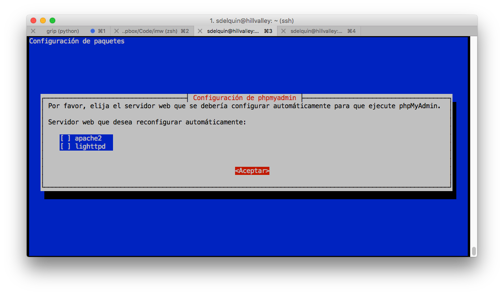
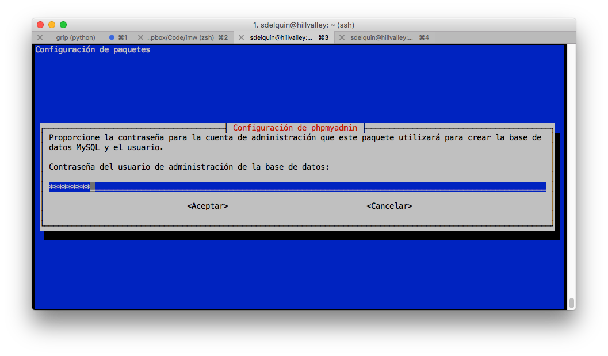
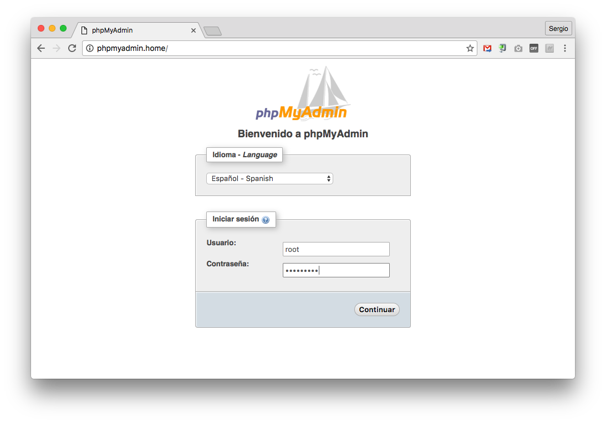

# phpMyAdmin

Si bien es cierto que podemos gestionar nuestras bases de datos **MySQL** desde el intérprete de terminal usando el comando `mysql`, existen otras alternativas con interfaz gráfica de usuario (GUI).

La herramienta más extendida para ello se denomina **phpMyAdmin**. Está implementada en el lenguaje de programación *php* y se accede a través de un servidor web, en nuestro caso **Nginx** que ya hemos configurado para que procese peticiones *php*.

## Instalación

Para su instalación, usaremos el paquete preparado a tal efecto:

```console
root@hillvalley:~# apt-get install phpmyadmin
Leyendo lista de paquetes... Hecho
Creando árbol de dependencias
Leyendo la información de estado... Hecho
Se instalarán los siguientes paquetes extras:
  dbconfig-common libjs-sphinxdoc libjs-underscore libltdl7 libmcrypt4 php-gettext php-tcpdf php5-gd php5-mcrypt
  php5-mysql
Paquetes sugeridos:
  libmcrypt-dev mcrypt php5-imagick
Se instalarán los siguientes paquetes NUEVOS:
  dbconfig-common libjs-sphinxdoc libjs-underscore libltdl7 libmcrypt4 php-gettext php-tcpdf php5-gd php5-mcrypt
  php5-mysql phpmyadmin
0 actualizados, 11 nuevos se instalarán, 0 para eliminar y 0 no actualizados.
Se necesita descargar 12,7 MB de archivos.
Se utilizarán 47,2 MB de espacio de disco adicional después de esta operación.
¿Desea continuar? [S/n]
Des:1 http://ftp.es.debian.org/debian/ jessie/main libltdl7 amd64 2.4.2-1.11 [45,2 kB]
Des:2 http://security.debian.org/ jessie/updates/main php5-gd amd64 5.6.24+dfsg-0+deb8u1 [28,8 kB]
Des:3 http://ftp.es.debian.org/debian/ jessie/main dbconfig-common all 1.8.47+nmu3+deb8u1 [628 kB]
Des:4 http://security.debian.org/ jessie/updates/main php5-mcrypt amd64 5.6.24+dfsg-0+deb8u1 [15,5 kB]
Des:5 http://security.debian.org/ jessie/updates/main php5-mysql amd64 5.6.24+dfsg-0+deb8u1 [65,1 kB]
Des:6 http://ftp.es.debian.org/debian/ jessie/main libjs-underscore all 1.7.0~dfsg-1 [49,9 kB]
Des:7 http://security.debian.org/ jessie/updates/main phpmyadmin all 4:4.2.12-2+deb8u2 [3.853 kB]
Des:8 http://ftp.es.debian.org/debian/ jessie/main libjs-sphinxdoc all 1.2.3+dfsg-1 [41,1 kB]
Des:9 http://ftp.es.debian.org/debian/ jessie/main libmcrypt4 amd64 2.5.8-3.3 [71,2 kB]
Des:10 http://ftp.es.debian.org/debian/ jessie/main php-gettext all 1.0.11-1 [17,3 kB]
Des:11 http://ftp.es.debian.org/debian/ jessie/main php-tcpdf all 6.0.093+dfsg-1 [7.878 kB]
Descargados 12,7 MB en 1s (8.743 kB/s)
Preconfigurando paquetes ...
```

El programa de instalación nos abrirá varios diálogos para configurar nuestro *phpMyAdmin*. En primer lugar nos pregunta por el servidor web que vamos a utilizar. Las dos únicas alternativas que ofrece son:
* apache2
* lighthttpd

Dado que nosotros utilizamos *Nginx*, lo dejamos en blanco y pulsamos en <kbd>Aceptar</kbd>:



A continuación el programa de instalación debe crear una base de datos para que *phpMyAdmin* pueda trabajar. Pulsamos el botón <kbd>Sí</kbd>


Para ello, nos solicita la contraseña del usuario `root` de **MySQL**:



El programa de instalación también creará un usuario y una contraseña específicos, que son los que se usarán para acceder a la base de datos. En la siguiente pantalla es donde debemos crear una contraseña de acceso a la base de datos para *phpMyAdmin*:


Después de esto, el programa de instalación termina de configurar los paquetes pendientes. Pero aún no hemos acabado, ya que debemos configurar nuestro **Nginx** para que pueda servir **phpMyAdmin**.

Vamos a crear un *virtual host* para la url `http://phpmyadmin.ies` que nos permita trabajar con la plataforma:

```console
root@hillvalley:~# vi /etc/nginx/sites-available/phpmyadmin
```

> Contenido
```nginx
server {
    server_name phpmyadmin.home;
    index index.php;
    root /usr/share/phpmyadmin;
    location ~ \.php$ {
        try_files $uri =404;
        include snippets/fastcgi-php.conf;
        fastcgi_pass unix:/var/run/php5-fpm.sock;
    }
}
```

Ahora enlazamos el *virtual host* en los sitios disponibles:

```console
root@hillvalley:~# cd /etc/nginx/sites-enabled/
root@hillvalley:/etc/nginx/sites-enabled# ln -s ../sites-available/phpmyadmin
```

Ahora sólo nos queda recargar el servidor web:

```console
root@hillvalley:~# /etc/init.d/nginx reload
[ ok ] Reloading nginx configuration (via systemctl): nginx.service.
root@hillvalley:~#
```

Con esto, ya podemos acceder a través de un navegador a la dirección en la que hemos configurado nuestro *phpMyAdmin*:



Introducimos el usuario y contraseña `root` del sistema gestor de bases de datos *MySQL*, y ya podremos acceder a la interfaz administrativa:


* [x] Instalación de **phpMyAdmin**
