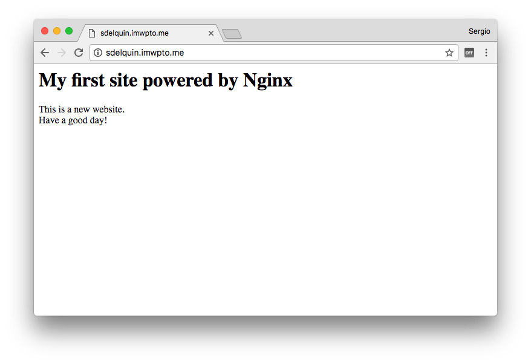
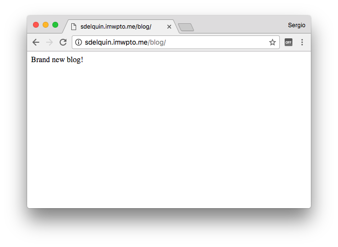
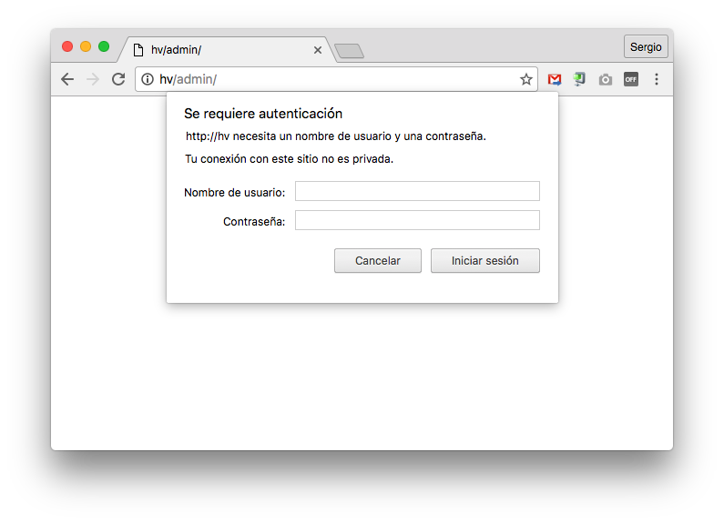
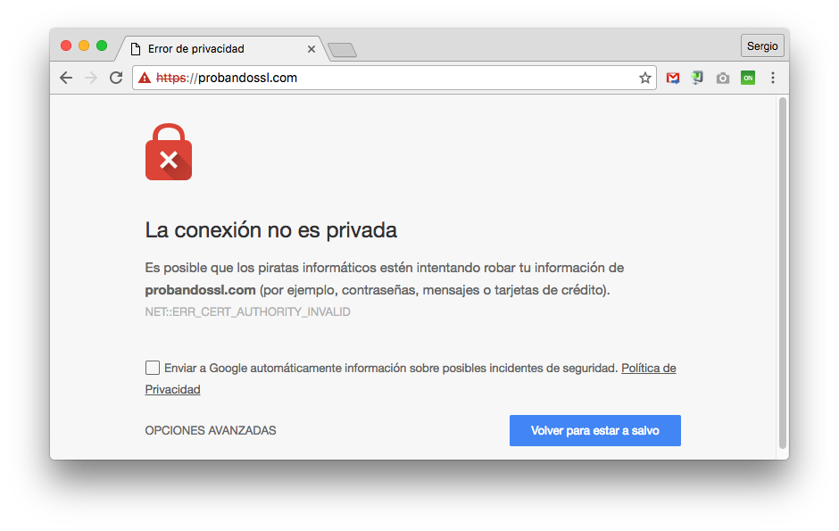

# Servidor Web

[Instalando Nginx](#instalando-nginx)  
[Server y Location](#server-y-location)  
[Rutas destacadas](#rutas-destacadas)  
[Listado de directorios](#listado-de-directorios)  
[Acceso restringido con clave](#acceso-restringido-con-clave)  
[Ficheros de log](#ficheros-de-log)  
[Configurando SSL](#configurando-ssl)  
[Redirecciones](#redirecciones)  
[Variables](#variables)

## Instalando Nginx

El servidor con el que vamos a trabajar será **Nginx**.

La instalación del servidor **Nginx** es muy sencilla. Lo único que debemos hacer es utilizar el paquete preparado al efecto.

Lo primero es cambiar a la cuenta de `root` y actualizar la lista de paquetes:

```console
sdelquin@hillvalley:~$ su
Contraseña:
root@hillvalley:/home/sdelquin# cd
root@hillvalley:~# apt-get update
Ign http://ftp.es.debian.org jessie InRelease
Des:1 http://ftp.es.debian.org jessie-updates InRelease [142 kB]
Des:2 http://security.debian.org jessie/updates InRelease [63,1 kB]
Obj http://ftp.es.debian.org jessie Release.gpg
Des:3 http://ftp.es.debian.org jessie-updates/main Sources [15,5 kB]
Des:4 http://ftp.es.debian.org jessie-updates/main amd64 Packages/DiffIndex [5.440 B]
Des:5 http://security.debian.org jessie/updates/main Sources [160 kB]
Des:6 http://ftp.es.debian.org jessie-updates/main Translation-en/DiffIndex [2.704 B]
Obj http://ftp.es.debian.org jessie Release
Obj http://ftp.es.debian.org jessie/main Sources
Des:7 http://security.debian.org jessie/updates/main amd64 Packages [302 kB]
Obj http://ftp.es.debian.org jessie/main amd64 Packages
Obj http://ftp.es.debian.org jessie/main Translation-es
Des:8 http://security.debian.org jessie/updates/main Translation-en [161 kB]
Obj http://ftp.es.debian.org jessie/main Translation-en
Descargados 851 kB en 3s (257 kB/s)
Leyendo lista de paquetes... Hecho
root@hillvalley:~#
```

A continuación instalaremos el paquete `nginx`:

```console
root@hillvalley:~# apt-get install nginx
Leyendo lista de paquetes... Hecho
Creando árbol de dependencias
Leyendo la información de estado... Hecho
Se instalarán los siguientes paquetes extras:
  libgd3 libvpx1 libxpm4 libxslt1.1 nginx-common nginx-full
Paquetes sugeridos:
  libgd-tools fcgiwrap nginx-doc ssl-cert
Se instalarán los siguientes paquetes NUEVOS:
  libgd3 libvpx1 libxpm4 libxslt1.1 nginx nginx-common nginx-full
0 actualizados, 7 nuevos se instalarán, 0 para eliminar y 0 no actualizados.
Se necesita descargar 1.616 kB de archivos.
Se utilizarán 4.324 kB de espacio de disco adicional después de esta operación.
¿Desea continuar? [S/n]
Des:1 http://ftp.es.debian.org/debian/ jessie/main libvpx1 amd64 1.3.0-3 [599 kB]
Des:2 http://security.debian.org/ jessie/updates/main libgd3 amd64 2.1.0-5+deb8u6 [148 kB]
Des:3 http://ftp.es.debian.org/debian/ jessie/main libxpm4 amd64 1:3.5.11-1+b1 [48,1 kB]
Des:4 http://security.debian.org/ jessie/updates/main libxslt1.1 amd64 1.1.28-2+deb8u1 [232 kB]
Des:5 http://security.debian.org/ jessie/updates/main nginx-common all 1.6.2-5+deb8u2 [86,7 kB]
Des:6 http://security.debian.org/ jessie/updates/main nginx-full amd64 1.6.2-5+deb8u2+b1 [430 kB]
Des:7 http://security.debian.org/ jessie/updates/main nginx all 1.6.2-5+deb8u2 [72,2 kB]
Descargados 1.616 kB en 0s (2.202 kB/s)
Seleccionando el paquete libvpx1:amd64 previamente no seleccionado.
(Leyendo la base de datos ... 31251 ficheros o directorios instalados actualmente.)
Preparando para desempaquetar .../libvpx1_1.3.0-3_amd64.deb ...
Desempaquetando libvpx1:amd64 (1.3.0-3) ...
Seleccionando el paquete libxpm4:amd64 previamente no seleccionado.
Preparando para desempaquetar .../libxpm4_1%3a3.5.11-1+b1_amd64.deb ...
Desempaquetando libxpm4:amd64 (1:3.5.11-1+b1) ...
Seleccionando el paquete libgd3:amd64 previamente no seleccionado.
Preparando para desempaquetar .../libgd3_2.1.0-5+deb8u6_amd64.deb ...
Desempaquetando libgd3:amd64 (2.1.0-5+deb8u6) ...
Seleccionando el paquete libxslt1.1:amd64 previamente no seleccionado.
Preparando para desempaquetar .../libxslt1.1_1.1.28-2+deb8u1_amd64.deb ...
Desempaquetando libxslt1.1:amd64 (1.1.28-2+deb8u1) ...
Seleccionando el paquete nginx-common previamente no seleccionado.
Preparando para desempaquetar .../nginx-common_1.6.2-5+deb8u2_all.deb ...
Desempaquetando nginx-common (1.6.2-5+deb8u2) ...
Seleccionando el paquete nginx-full previamente no seleccionado.
Preparando para desempaquetar .../nginx-full_1.6.2-5+deb8u2+b1_amd64.deb ...
Desempaquetando nginx-full (1.6.2-5+deb8u2+b1) ...
Seleccionando el paquete nginx previamente no seleccionado.
Preparando para desempaquetar .../nginx_1.6.2-5+deb8u2_all.deb ...
Desempaquetando nginx (1.6.2-5+deb8u2) ...
Procesando disparadores para man-db (2.7.0.2-5) ...
Procesando disparadores para systemd (215-17+deb8u4) ...
Configurando libvpx1:amd64 (1.3.0-3) ...
Configurando libxpm4:amd64 (1:3.5.11-1+b1) ...
Configurando libgd3:amd64 (2.1.0-5+deb8u6) ...
Configurando libxslt1.1:amd64 (1.1.28-2+deb8u1) ...
Configurando nginx-common (1.6.2-5+deb8u2) ...
Configurando nginx-full (1.6.2-5+deb8u2+b1) ...
Configurando nginx (1.6.2-5+deb8u2) ...
Procesando disparadores para libc-bin (2.19-18+deb8u4) ...
Procesando disparadores para systemd (215-17+deb8u4) ...
root@hillvalley:~#
```

Con esto, en principio, debería estar instalado el servidor web **Nginx**. Podemos comprobarlo con el siguiente comando:

```console
root@hillvalley:~# /etc/init.d/nginx status
● nginx.service - A high performance web server and a reverse proxy server
   Loaded: loaded (/lib/systemd/system/nginx.service; enabled)
   Active: active (running) since sáb 2016-08-27 00:45:55 WEST; 8min ago
 Main PID: 1359 (nginx)
   CGroup: /system.slice/nginx.service
           ├─1359 nginx: master process /usr/sbin/nginx -g daemon on; master_process on;
           ├─1360 nginx: worker process
           ├─1361 nginx: worker process
           ├─1362 nginx: worker process
           └─1364 nginx: worker process
root@hillvalley:~#
```

Para comprobar nuestra instalación de **Nginx**, accedemos a la IP de la máquina:


## Rutas destacadas

El directorio *root* por defecto de Nginx es: `/var/www/html`. Si echamos un vistazo, vemos lo siguiente:

```console
root@hillvalley:~# ls -l /var/www/html/
total 4
-rw-r--r-- 1 root root 867 ago 27 00:45 index.nginx-debian.html
root@hillvalley:~#
```

Cuando accedemos a nuestra máquina de producción, lo que realmente está pasando es que Nginx trata de buscar un fichero índice en el *root*. De hecho si miramos el contenido del fichero `index.nginx-debian.html` podemos ver que su contenido coincide con lo que nos muestra el servidor web:

```console
root@hillvalley:~# cat /var/www/html/index.nginx-debian.html
<!DOCTYPE html>
<html>
<head>
<title>Welcome to nginx on Debian!</title>
<style>
    body {
        width: 35em;
        margin: 0 auto;
        font-family: Tahoma, Verdana, Arial, sans-serif;
    }
</style>
</head>
<body>
<h1>Welcome to nginx on Debian!</h1>
<p>If you see this page, the nginx web server is successfully installed and
working on Debian. Further configuration is required.</p>

<p>For online documentation and support please refer to
<a href="http://nginx.org/">nginx.org</a></p>

<p>
      Please use the <tt>reportbug</tt> tool to report bugs in the
      nginx package with Debian. However, check <a
      href="http://bugs.debian.org/cgi-bin/pkgreport.cgi?ordering=normal;archive=0;src=nginx;repeatmerged=0">existing
      bug reports</a> before reporting a new bug.
</p>

<p><em>Thank you for using debian and nginx.</em></p>


</body>
</html>
root@hillvalley:~#
```

Podríamos decir que Nginx dispone de dos ficheros destacados de configuración:

* `/etc/nginx/nginx.conf`: para las configuraciones del servicio.
* `/etc/nginx/sites-enabled/default`: para las configuraciones del sitio web.

## Server y Location

*Nginx* se configura a través de bloques de mayor nivel llamados `server` (servidor ó *virtual host*) y de `location` (ubicaciones) dentro de esos servidores.


Cada vez que queramos incluir un nuevo *virtual host*, debemos incluir un fichero en la ruta `/etc/nginx/sites-available` y luego enlazar dicho fichero desde la ruta `/etc/nginx/sites-enabled`.

Supongamos que queremos mostrar una página web que hemos creado en la carpeta *home* del usuario *sdelquin*. Además queremos que se muestre esa página cuando se acceda en el navegador a la *url* `http://hv/`.

Lo primero es, desde la *máquina de desarrollo*, añadir el nombre *hv* al fichero `/etc/hosts` para que apunte a nuestra *máquina de producción*:

```console
~|🍺  sudo vi /etc/hosts
Password:
```

> Contenido
```console
...
192.168.1.118 hillvalley hv
...
```

Ahora, desde la *máquina de producción*, y como usuario `root`, añadiremos el fichero de configuración de *Nginx* que tratará las peticiones que se hagan al nombre de dominio *nv*:

```console
root@hillvalley:~# vi /etc/nginx/sites-available/hv
```

> Contenido
```nginx
server {
    server_name hv;
    root /home/sdelquin;
}
```

A continuación tenemos que enlazar el fichero que hemos creado para que esté disponible desde los `sites-enabled`:

```console
root@hillvalley:~# cd /etc/nginx/sites-enabled/
root@hillvalley:/etc/nginx/sites-enabled# ln -s ../sites-available/hv
root@hillvalley:/etc/nginx/sites-enabled#
```

Por último, tenemos que recargar la configuración de *Nginx* para que los cambios surtan efecto:

```console
root@hillvalley:/etc/nginx/sites-enabled# /etc/init.d/nginx reload
[ ok ] Reloading nginx configuration (via systemctl): nginx.service.
root@hillvalley:/etc/nginx/sites-enabled#
```

Ahora ya podemos escribir nuestra página web en nuestro *home*, utilizando el usuario no privilegiado `sdelquin`:

```console
sdelquin@hillvalley:~$ vi mywebsite.html
```

> Contenido:
```html
Esto es un nuevo virtual host.<br>
By sdelquin.
```

Si ahora accedemos desde un navegador, deberíamos ver lo siguiente:



Supongamos que ahora queremos, que cuando se acceda a `http://hv/blog/`, nos muestre la web que hemos diseñado en el directorio `/home/sdelquin/webapps/blog`. Dado que se trata de un *location* dentro de un *virtual host*, tendremos que utilizar esta directiva. Una vez más, desde la *máquina de producción*, y como `root`, haremos lo siguiente:

```console
root@hillvalley:~# vi /etc/nginx/sites-available/hv
```

> Contenido
> ```nginx
> server {
>     server_name hv;
>     root /home/sdelquin;
> 
>     location /blog {
>         root /home/sdelquin/webapps;
>     }
> }
> ```

Una vez más, recargamos nuestro servidor para que los cambios surtan efecto:

```console
root@hillvalley:~# /etc/init.d/nginx reload
[ ok ] Reloading nginx configuration (via systemctl): nginx.service.
root@hillvalley:~#
```

Ahora, como usuario `sdelquin`, podemos desarrollar nuestro blog en la ruta `/home/sdelquin/webapps/blog`. Lo típico sería empezar por un fichero `index.html`. Si accedemos mediante un navegador, deberíamos ver algo como lo siguiente:



## Listado de directorios

Existen multitud de parámetros que se pueden configurar para los sitios web que se definen en *Ningx*.

Uno de ellos es `autoindex` y nos permite *listar el contenido del directorio actual*, pudiendo implementar una especie de *FTP* a través del navegador. Para habilitarla debemos hacer lo siguiente:

```console
root@hillvalley:~# vi /etc/nginx/sites-enabled/default
```

> Contenido
```nginx
...
location / {
    ...
    autoindex on;
    ...
}
...
```

Ahora recargamos el servidor para que los cambios tengan efecto:

```console
root@hillvalley:~# /etc/init.d/nginx reload
[ ok ] Reloading nginx configuration (via systemctl): nginx.service.
root@hillvalley:~#
```

> NOTA: Hay que tener mucho cuidado con el uso de esta configuración, pues dará acceso al contenido de los subdirectorios que cuelgan de `/var/www/html`

## Acceso restringido con clave

Es posible pedir usuario/clave al acceder a determinadas ubicaciones de nuestro servidor *Nginx*.

Supongamos que queremos tener acceso a la carpeta `/var/opt/admin`, pero que no nos interesa que sea pública, sino a través de un usuario/clave.

En primer lugar tendremos que generar el fichero `.htpasswd`. Este fichero tiene una estructura en el que cada línea identifica a un posible usuario en la forma:

```
username:encrypted-password:comment
```

Para generar nuestro *password* encriptado, podemos usar el lenguaje *perl* (que suele instalarse con el sistema base), utilizando el siguiente comando desde la *máquina de producción* como usuario `root`:

```console
root@hillvalley:~# perl -le 'print crypt("restringido", "salt-hash")'
saOQOMmS3k30w
root@hillvalley:~#
```

Lo que hemos hecho es encriptar el password `restringido`. Ahora podemos crear el fichero `.htpasswd`:

```console
root@hillvalley:~# cd /var/opt/
root@hillvalley:/var/opt# mkdir admin
root@hillvalley:/var/opt# vi .htpasswd
```

> Contenido
```
admin:saOQOMmS3k30w
```

Ahora añadimos el *location* correspondiente a nuestra configuración de *Nginx*:

```console
root@hillvalley:~# vi /etc/nginx/sites-enabled/hv
```

> Contenido
```nginx
server {
    server_name hv;
    ...
    location /admin {
        root /var/opt;
        auth_basic "Administrator Login";
        auth_basic_user_file /var/opt/admin/.htpasswd;
        autoindex on;
    }
    ...
}
...
```

Recargamos la configuración de *Nginx* y probamos el acceso. Al acceder a la ruta `http://hv/admin` vemos que nos aparece un cuadro de diálogo preguntándonos por el usuario/clave:



Rellenamos los campos con las credenciales que pusimos anteriormente en el fichero de configuración: `admin` | `restringido`:


Vemos que podemos acceder y se nos muestra el contenido del directorio, que ahora mismo, está vacío:


Pero aún no hemos terminado la configuración. Si dejáramos el servidor tal cual, tendríamos un grave problema de seguridad, ya que podríamos acceder al fichero `.htpasswd` desde el navegador, simplemente accediendo a `http://hv/admin/.htpasswd`.

Para evitar eso debemos añadir un par de líneas de configuración en el fichero de configuración del *virtual host*:

```console
root@hillvalley:~# vi /etc/nginx/sites-enabled/hv
```

> Contenido
> ```nginx
> server {
>     server_name hv;
>     ...
>     location /admin {
>         root /var/opt;
>         auth_basic "Administrator Login";
>         auth_basic_user_file /var/opt/admin/.htpasswd;
>         autoindex on;
> 
>         location ~ .htpasswd {
>             deny all;
>         }
>     }
>     ...
> }
> ```

Si ahora recargamos la configuración de *Nginx* y queremos acceder al fichero de contraseñas, lo que obtenemos es un error *404*:


## Ficheros de log

Es importante conocer la ubicación de los *logfiles* de *Nginx*. Por defecto, estos ficheros son los siguientes:

* `/var/log/nginx/access.log`
* `/var/log/nginx/error.log`

Además, para cada *virtual host* y/o para cada *location*, podemos definir *logfiles* propios. Para hacer esto habría que añadir las siguientes líneas a las secciones correspondientes:

```nginx
server {
    ...
    access_log /path/to/your/access.log;
    error_log /path/to/your/error.log;
    ...
}
```

## Configurando SSL

Cuando queremos que nuestro sitio web use *SSL* (Secure Sockets Layer), necesitamos configurar el servidor web *Nignx* con certificados de seguridad, específicamente creados para nuestro dominio. El procedimiento que se debe seguir para esto se explica a continuación:


Por lo tanto, necesitamos contar con 4 ficheros, más un quinto que se genera a partir de otros dos. Los ficheros serían los siguientes:

- `server.key`: clave privada.
- `server.crs`: solicitud de firma de certificado de seguridad.
- `SSL.crt`: certificado SSL.
- `intermediate.crt`: certificados intermedios.
- `SSL.final.crt`: certificado final resultante de la unión de `SSL.crt` y `intermediate.crt`

> Hoy en día, las entidades certificadoras facilitan la creación de todos estos ficheros, a través de sencillos asistentes. Una vez que obtengamos los citados ficheros, se suelen guardar en `/etc/ssl/`. Ejemplo: [DonDominio](http://dondominio.com)

Vamos a configurar un *virtual host* para que use *SSL*. Imaginemos que nuestro dominio es `probandossl.com`.

Lo primero que habría que hacer es generar los certificados, pero en vez de usar una entidad certificadora externa, vamos a generar unos certificados propios (sin validar). Desde la *máquina de producción*, y como `root` hacemos lo siguiente:

```console
root@hillvalley:~# openssl req -x509 -nodes -days 365 -newkey rsa:2048 -keyout /etc/ssl/server.key -out /etc/ssl/SSL.final.crt
Generating a 2048 bit RSA private key
................................................+++
..+++
writing new private key to '/etc/ssl/server.key'
-----
You are about to be asked to enter information that will be incorporated
into your certificate request.
What you are about to enter is what is called a Distinguished Name or a DN.
There are quite a few fields but you can leave some blank
For some fields there will be a default value,
If you enter '.', the field will be left blank.
-----
Country Name (2 letter code) [AU]:
State or Province Name (full name) [Some-State]:
Locality Name (eg, city) []:
Organization Name (eg, company) [Internet Widgits Pty Ltd]:
Organizational Unit Name (eg, section) []:
Common Name (e.g. server FQDN or YOUR name) []:probandossl.com
Email Address []:
root@hillvalley:~#
```

Parámetros del comando anterior:

- `req -x509`: generar un certificado auto firmado, en vez de generar una solicitud de firma de certificado.
- `-nodes`: evita que se solicite un *passphrase* para el certificado.
- `-days 365`: cantidad de días que se considera válido el certificado.
- `-newkey rsa:2048`: crear un nuevo certificado y una nueva clave al mismo tiempo.
- `-keyout`: dónde guardar el fichero de clave privada.
- `-out`: dónde guardar el certificado generado.

El comando nos pide una serie de datos. El único campo que es importante (para estas pruebas) es `Common Name (e.g. server FQDN or YOUR name)`, donde tendremos que poner el nombre de dominio que vamos a utilizar. Cuando este comando finaliza ya tenemos a nuestra disposición los dos ficheros que nos van a permitir completar el fichero de configuración de nuestro *virtual host* en el servidor *Nginx*:

```console
root@hillvalley:~# vi /etc/nginx/sites-available/probandossl
```

> Contenido
> ```nginx
> server {
>     listen 443;
>     server_name probandossl.com;
>     root /var/www/html/probandossl;
> 
>     ssl on;
>     ssl_certificate /etc/ssl/SSL.final.crt;
>     ssl_certificate_key /etc/ssl/server.key;
> }
> ```

Ya sólo nos quedaría enlazar este *virtual host* en `sites-enabled`, y recargar la configuración de *Nginx* para que los cambios surtan efecto.

Cuando accedemos a nuestro *virtual host* desde un navegador, vemos lo siguiente:



Si pulsamos en *OPCIONES AVANZADAS* -> *Acceder a probandossl.com (sitio no seguro)*


Conseguimos acceder a la web que hemos preparado, y se nos muestra el contenido del `index.html` que se haya definido en el lugar correspondiente.


Si miramos el certificado de la página, podemos ver 3 cuestiones importantes:

1. Hay un error con el certificado, porque la *autoridad certificadora* es inválida.
2. La conexión es *TLS* (seguridad en la capa de transporte) con cifrado.
3. Todos los recursos de la página se sirven de forma segura.


## Redirecciones

Puede darse el caso de que queramos redireccionar ciertas *urls* a otras. De hecho, podría utilizarse como regla general, el hecho de trabajar siempre sobre la url `https://tudominio.com`.

```nginx
# Redirige de http://tudominio.com a https://tudominio.com
server {  
    listen 80;
    return 301 https://$host$request_uri;
}

# Redirige de http://www.tudominio.com a https://tudominio.com
server {  
    listen 80;
    server_name www.tudominio.com;
    return 301 https://tudominio.com$request_uri;
}

# Redirige de https://www.tudominio.com a https://tudominio.com
server {  
    listen 443;
    server_name www.tudominio.com;
    return 301 $scheme://tudominio.com$request_uri;
}
```

## Variables

*Nginx* dispone de multitud de **variables de configuración** que podemos usar según nos convengan, dentro de nuestros *virtual hosts*.

[Variables de configuración](http://nginx.org/en/docs/varindex.html)
