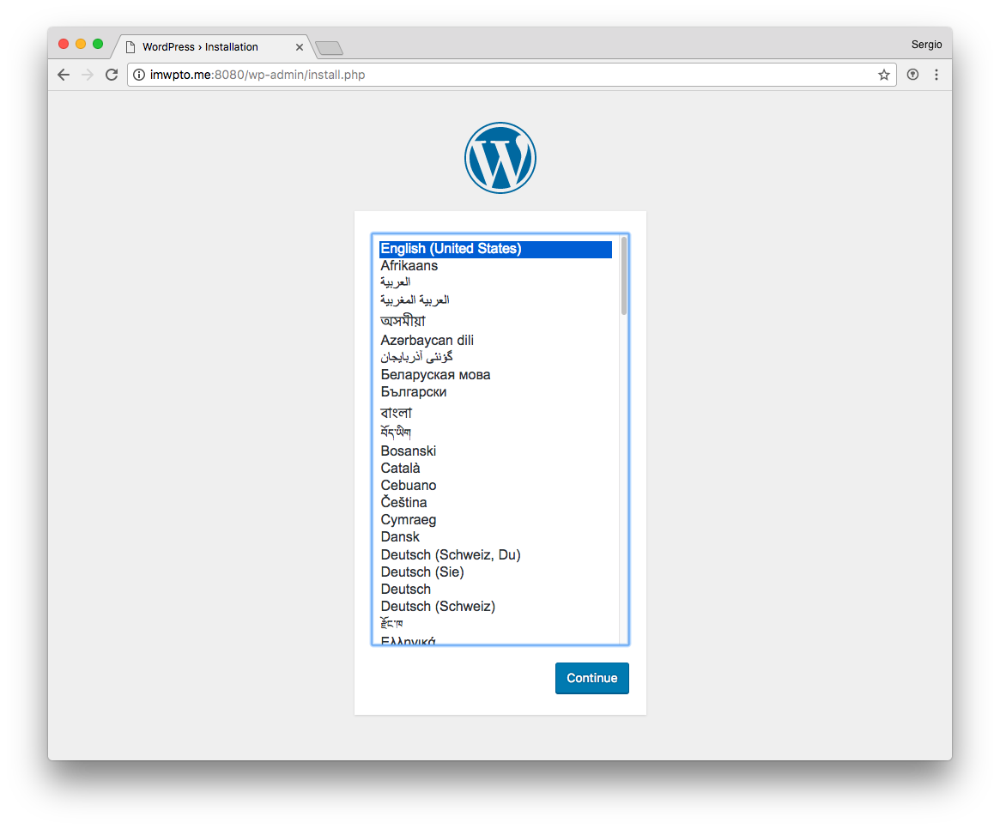
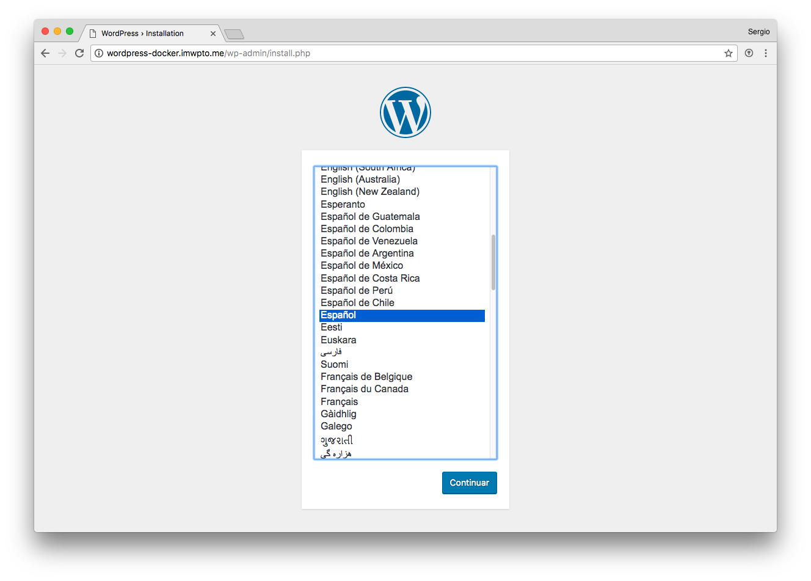

# Dockerizando Wordpress

En primer lugar vamos a crear un fichero para componer nuestros contenedores:

~~~console
sdelquin@cloud:~$ mkdir wordpress
sdelquin@cloud:~$ cd wordpress
sdelquin@cloud:~/wordpress$ vi docker-compose.yml
~~~

> Contenido:

~~~yml
version: '3.1'

services:

  wordpress:
    image: wordpress
    restart: always
    ports:
      - 8080:80
    environment:
      WORDPRESS_DB_PASSWORD: mydocker2018

  mysql:
    image: mysql
    restart: always
    environment:
      MYSQL_ROOT_PASSWORD: mydocker2018
~~~

Ahora lanzamos los servicios:

~~~console
sdelquin@cloud:~/wordpress$ docker-compose up
Creating wordpress_wordpress_1 ... done
Creating wordpress_mysql_1     ... done
Attaching to wordpress_mysql_1, wordpress_wordpress_1
...
...
...
~~~

Si accedemos al puerto `8080` en la dirección de nuestra máquina de producción, podremos ver que accedemos al instalador de Wordpress:

 

## Configuración Nginx

Lo primero que debemos hacer es dejar en "background" los contenedores de Docker:

~~~console
sdelquin@cloud:~/wordpress$ docker-compose up -d
Creating wordpress_wordpress_1 ... done
Creating wordpress_mysql_1     ... done
sdelquin@cloud:~/wordpress$
~~~

A continuación creamos un virtual host para Nginx:

~~~console
sdelquin@cloud:~$ sudo vi /etc/nginx/sites-available/wordpress-docker
~~~

> Contenido:

~~~nginx
server {
    server_name wordpress-docker.imwpto.me;

    location / {
        proxy_pass http://127.0.0.1:8080;

        proxy_redirect     off;
        proxy_set_header   Host $host;
        proxy_set_header   X-Real-IP $remote_addr;
        proxy_set_header   X-Forwarded-For $proxy_add_x_forwarded_for;
        proxy_set_header   X-Forwarded-Host $server_name;
    }
}
~~~

Activamos el virtual host:

~~~console
sdelquin@cloud:~$ sudo ln -s /etc/nginx/sites-available/wordpress-docker /etc/nginx/sites-enabled/
sdelquin@cloud:~$
~~~

Recargamos la configuración de Nginx:

~~~console
sdelquin@cloud:~$ sudo systemctl reload nginx
sdelquin@cloud:~$
~~~

Ahora podremos acceder a la web a través de la nueva URL:

  
